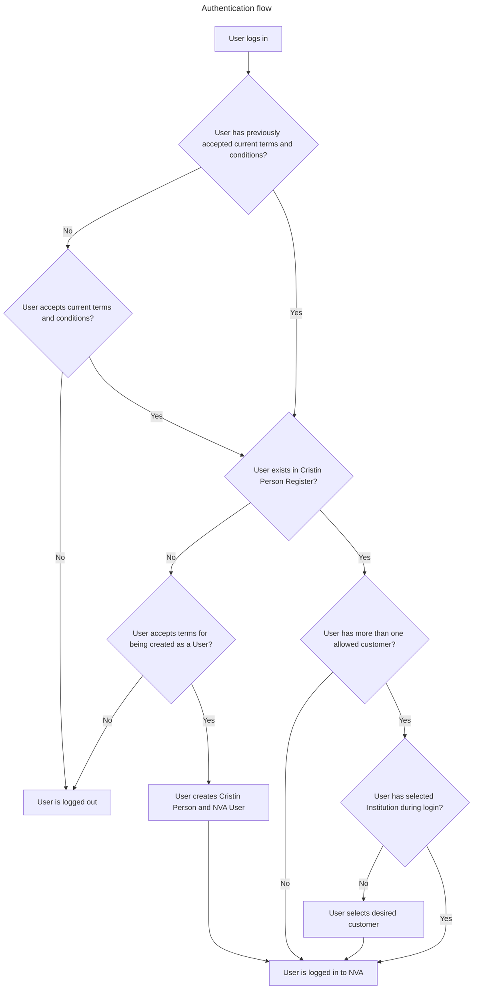

# Authentication

The following mermaid flowchart depicts the authentication flow for the frontend.

```mermaid
---
title: Authentication flow
---
flowchart TD
    A[User logs in] --> B{User has previously accepted current terms and conditions?}

    B -- No --> C{User accepts current terms and conditions?}
    B -- Yes --> D{User exists in Cristin Person Register?}

    C -- No --> E[User is logged out]
    C -- Yes --> D

    D -- No --> F{User accepts terms for being created as a User?}
    D -- Yes --> G{User has more than one allowed customer?}

    F -- No --> E
    F -- Yes --> H[User creates Cristin Person and NVA User]

    G -- No --> I[User is logged in to NVA]
    G -- Yes --> J{User has selected Institution during login?}

    J -- No --> K[User selects desired customer]
    J -- Yes --> I

    K --> I
    H --> I
```
