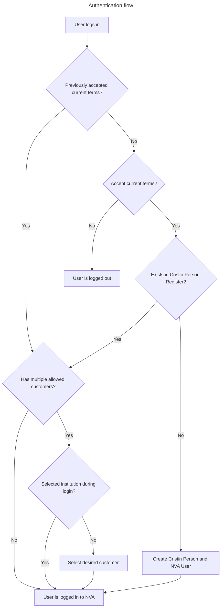

# Authentication

The following flowchart depicts the authentication flow for the frontend app.

```mermaid
---
title: Authentication flow
---
flowchart TD
    login[User logs in]
    hasAcceptedTerms{Previously accepted current terms?}
    acceptTerms{Accept current terms?}
    existsInCristin{Exists in Cristin Person Register?}
    logout[User is logged out]
    hasMultipleCustomers{Has multiple allowed customers?}
    createUser[Create Cristin Person and NVA User]
    loggedIn[User is logged in to NVA]
    hasSelectedInstitution{Selected institution during login?}
    selectCustomer[Select desired customer]

    login --> hasAcceptedTerms

    hasAcceptedTerms -- No --> acceptTerms
    hasAcceptedTerms -- Yes --> hasMultipleCustomers

    acceptTerms -- No --> logout
    acceptTerms -- Yes --> existsInCristin

    existsInCristin -- No --> createUser
    existsInCristin -- Yes --> hasMultipleCustomers

    hasMultipleCustomers -- No --> loggedIn
    hasMultipleCustomers -- Yes --> hasSelectedInstitution

    hasSelectedInstitution -- No --> selectCustomer
    hasSelectedInstitution -- Yes --> loggedIn

    selectCustomer --> loggedIn
    createUser --> loggedIn
```
