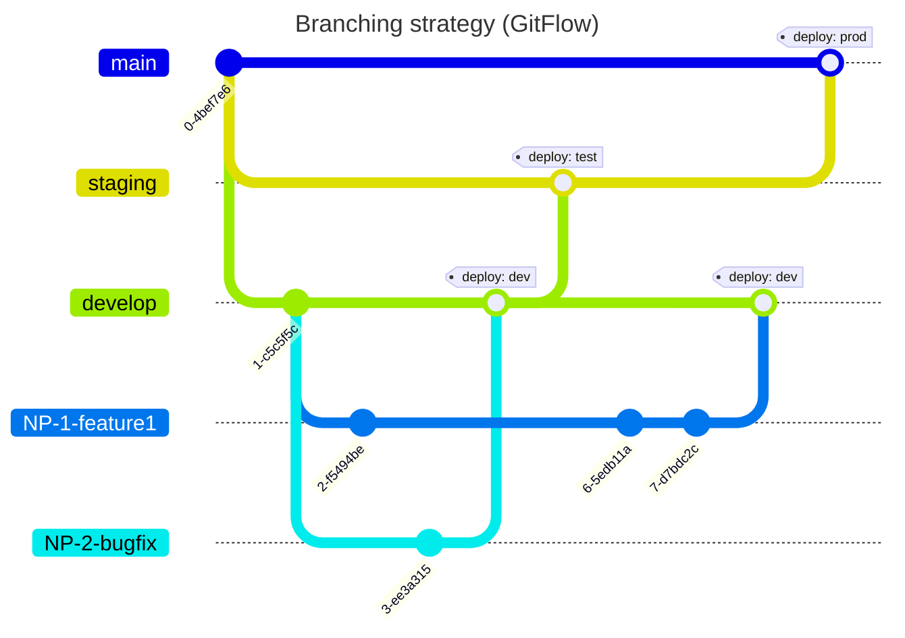

# Deployment

The app is deployed via [AWS Amplify](https://aws.amazon.com/amplify/) in the `FRONTEND PROD` [account for Sikt](https://aws.sikt.no/). DNS management is set up in [AWS Route 53](https://aws.amazon.com/route53/) in the same account.

## Environments

AWS Amplify is designed to work with feature branch and GitFlow workflows. Read more in the official docs: [Feature branch deployments and team workflows](https://docs.aws.amazon.com/amplify/latest/userguide/multi-environments.html).
We currently have 4 enviroments (dev, test, sandbox, prod) as described by the following table.

| Enviroment | URL                         | Branch    | Description                                                                                                                                                |
| ---------- | --------------------------- | --------- | ---------------------------------------------------------------------------------------------------------------------------------------------------------- |
| dev        | https://dev.nva.sikt.no     | `develop` | Under active development. Mainley used by internal users, e.g. the development team. Is password protected against the outside world (including crawlers). |
| test       | https://test.nva.sikt.no    | `staging` | Mainly used by external testers to verify work/progress before it reaches production.                                                                      |
| sandbox    | https://sandbox.nva.sikt.no | `sandbox` | Sandbox environment.                                                                                                                                       |
| prod       | https://nva.sikt.no         | `main`    | Production environment.                                                                                                                                    |

## Work process

All 4 branches mentioned are protected, and should never be deleted. If that happens anyway for some reason, Amplify should still keep the last deployment running as normal, but one can not deploy a new version before the deleted branch is recreated. In the case where a faulty version is deployed, one can redeploy a previous version with the click of a button in AWS Amplify.

The following figure is a simple representation of our process in practice.

### Lokalise

Lokalise is a software that we use for maintaining translations in different languages. The developers provide the translation in bokmål and external translaters provide the translations for other languages in the lokalise app. Because of this we need to merge the changes from lokalise into the devlop branch once translations have been added, and upon deployment is a good time to do it. To merge the changes we need to create a pull a pull request from lokalise into the develop branch by clicking the "build only" button in the [download section](https://app.lokalise.com/download/8976449362e0d7af005bc1.77420911/). This will create a PR in github (it might take some time), which can be merged. If there are no changes, there will be no PR in git. This can also be checked in the lokalise app.

### Update dev

When working on new features, bug fixes, etc, one should branch out from the `develop` branch. When the job is done, one should create a new PR back into the `develop` branch. Hence, `develop` should include all the newest features, and should always have the newest code. Once a PR is merged into `develop`, Amplify will detect the update and automatically update the app deployed for the dev environment.

### Update test

When one want to update the test environment one will usually create a PR from the `develop` branch into the `staging` branch. We prefer to write a title on the PR on the same format each time "Update staging CURRENT_DATE" to make it easier to find in the commit log. The description will typically be the change log. The merge should be done with "Create a merge commit" to ensure that all commits gets a separate commit message and to avoid merge conflicts. Once this PR is merged, Amplify will automatically update the test environment.

### Update sandbox

When one want to update the sandbox environment one will usually create a PR from the `develop` branch into the `sandbox` branch. Once this PR is merged, Amplify will automatically update the sandbox environment.

### Update prod

To update the prod environment one will usually create a PR from the `staging` branch (that should have been verified by necessary stakeholders on the test environment) into the `main` branch. We prefer to write a title on the PR on the same format "Update prod CURRENT_DATE" to make it easier to find in the commit log. The description will typically be the change log. The merge should be done with "Create a merge commit" to ensure that all commits gets a separate commit message and to avoid merge conflicts. Once this PR is merged, Amplify will automatically update the prod environment.

### Deploy a feature branch

In some cases one might want to deploy a feature branch to allow PO or other stakeholders to verify the changes before they are merged to `develop`. This can be achieved by using the "Connect branch" feature in AWS Amplify. After deploying the branch, environment variables `REACT_APP_REDIRECT_SIGN_IN` and `REACT_APP_REDIRECT_SIGN_OUT` must be set, and access control for the branch must be configured (if necessary). Remember to re-deploy after configuring environment variables. Lastly, the branch url has to be added to `Allowed callback URLs` and `Allowed sign-out URLs` in `Hosted UI` in `Cognito` in the NVA environment.

### A template for the release log

🚀 Ny funksjonalitet 🚀

- Description of change (Link to jira issue)

🐛 Bugfiks 🐛

- Description of change (Link to jira issue)

🎨 Designendringer 🎨

- Description of change (Link to jira issue)
