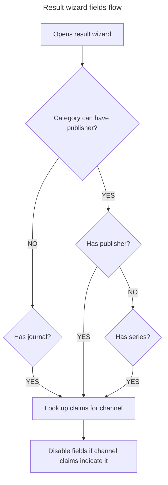

# Registration Wizard

This chart describes the flow to decide if fields should be disbaled due to channel claims.

```mermaid
---
title: Result wizard fields flow
---
flowchart TD
  opensWizard[Opens result wizard]
  categoryCanHavePubliser{Category can have publisher?}
  hasPublisher{Has publisher?}
  hasJournal{Has journal?}
  hasSeries{Has series?}
  lookupChannelClaims[Look up claims for channel]
  disableFieldsBasedOnChannelClaims[Disable fields if channel claims indicate it]

  opensWizard --> categoryCanHavePubliser
  categoryCanHavePubliser -- NO --> hasJournal
  hasJournal -- YES --> lookupChannelClaims
  categoryCanHavePubliser -- YES --> hasPublisher
  hasPublisher -- YES --> lookupChannelClaims
  hasPublisher -- NO --> hasSeries
  hasSeries -- YES --> lookupChannelClaims
  lookupChannelClaims --> disableFieldsBasedOnChannelClaims
```
